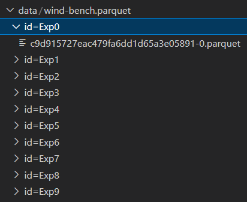

# CVS wind-bench file to parquet Dataset

In this directory, we define a python script `convert_to_parquet.py` that can process all csv files to construct incrementaly a huge dataset that is partitioned using and id built upon csv index number.

Please read parquet documentation : [Documentation](https://arrow.apache.org/docs/python/parquet.html)

### Output example
Given 10 csv files, you may obtain locally 



### Parameters 

- You can adjust the `frequency` that is 100Hz at the beginning to something less.
- You may skip for the first `offset` seconds of the signal
- You can push them directly to a S3 filesystem

> By default, each parquet file is zipped using snappy compression.

## How to run it

Adjust parameters in `config.json` to your needs, then

```
python ./convert_to_parquet.py  
```


